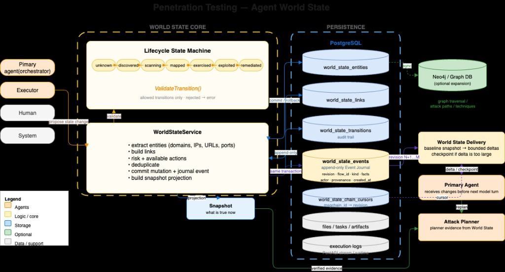
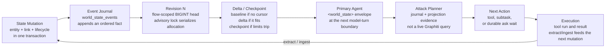
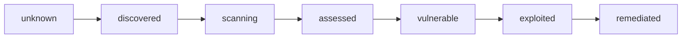

# World State architecture

## Core Idea

World State is designed as a universal, engine-agnostic intelligence layer for autonomous security agents. The current implementation was developed and validated on top of PentAGI, which serves as the underlying execution engine and reference environment.

However, the World State architecture is not conceptually tied to PentAGI: any agentic security framework capable of exposing execution observations and consuming structured state updates can integrate with the same state model, Event Journal, revision tracking, and delivery mechanisms.

World State is still a persistent structured representation of the pentest environment. It is also an event-driven control loop: committed mutations become ordered revisions, those revisions are delivered only to the primary agent, and the planner chooses the next action from that evidence.

  

  <em>Propose → validate lifecycle → commit journal + snapshot → deliver delta → replan</em>

## Agent World State

The design was motivated by the World Models framework introduced by Yang et al., which characterizes a world model through representations of environment dynamics, task structure, and reward. We adapt this idea to autonomous penetration testing, where the environment continuously changes as agents discover hosts, services, vulnerabilities, and exploitation outcomes. Building on this framework, we introduce a revisioned Event Journal and cursor-based state-delivery mechanism to make changes in the persistent World State observable to subsequent agent reasoning.

In autonomous penetration testing, observations are continuously produced by tool executions and specialized agents: new hosts are discovered, services are identified, vulnerabilities are assessed, and exploitation outcomes change the known state of the engagement. Persisting these observations is necessary, but persistence alone does not ensure that newly acquired knowledge affects subsequent agent behavior. A stored snapshot can represent what is currently known, but it does not by itself communicate what has changed since the agent last reasoned over that state.

The architecture therefore maintains two complementary representations:

- **Current State** — what is currently known about the penetration-testing environment.
- **Event Journal** — what has changed in that environment over time.

A durable revision cursor records the latest World State revision consumed by each Primary Agent chain. At the next reasoning boundary, previously unseen revisions are delivered to the Primary Agent as bounded state deltas. When the accumulated changes exceed the delivery budget, the system provides a checkpoint projection of the current state instead. If no new revision exists, no additional World State update is injected.

## Thesis

World State is still a persistent structured representation of the pentest environment. It is also an event-driven control loop: committed mutations become ordered revisions, those revisions are delivered only to the primary agent, and the planner chooses the next action from that evidence.

| 1 TX | Primary only | Next turn | Cursor |
|---|---|---|---|
| entity + link + transition + event | no auto-delivery to subagents | in-flight LLM calls are not interrupted | advances atomically with the envelope |

## Event-driven feedback loop

Closed contour. Delivery is empty when the chain cursor already equals the captured event head.

| Stage | What happens |
|---|---|
| **State Mutation** | Entity, link, and lifecycle change in one transaction. |
| **Event Journal** | `world_state_events` appends an ordered fact. |
| **Revision N** | Flow-scoped `BIGINT` head. Advisory lock serializes allocation. |
| **Delta / Checkpoint** | Baseline if no cursor. Delta if it fits. Checkpoint if limits trip. |
| **Primary Agent** | `<world_state>` envelope at the next model-turn boundary. |
| **Attack Planner** | Journal + projection evidence, not a live Graphiti query. |
| **Next Action** | Tool, subtask, or durable ask wait. |
| **Execution** | Tool run and result. Extract/ingest feeds the next mutation. |

Return path: **Execution → extract/ingest → State Mutation**.

## What the old diagram still gets right

**Agents.** Researcher, Developer, Executor, Human, and System propose observations. They do not write PostgreSQL. Tool output goes through `WorldStateService`.

**Lifecycle.** `unknown → discovered → scanning → assessed → vulnerable → exploited → remediated`. `WorldStateService` validates each transition before commit.

**Split of stores.** PostgreSQL is operational truth. Graphiti/Neo4j is an optional semantic index. `msglogs`, `termlogs`, and `toolcalls` are execution history, not World State.

## PostgreSQL

| Table | Role | Since |
|---|---|---|
| `world_state_entities` | What exists and in which lifecycle state | Storage schema |
| `world_state_links` | `HAS_SERVICE` / `HAS_FINDING` and other relations | Storage schema |
| `world_state_transitions` | Lifecycle audit: `discovered → scanning → …` | Storage schema |
| `world_state_events` | Ordered journal facts. Revision N is the flow head. | Journal |
| `world_state_chain_cursors` | What this primary chain has already consumed | Delivery |
| `agent_chain_waits` | Durable primary ask vs World State wake race | Wake |

## Delivery selection

| Condition | Kind | Payload |
|---|---|---|
| No cursor | `baseline` | Bounded projection of current entities and links |
| Cursor behind head, fits limits | `delta` | Revisions `(cursor, head]` |
| Event count or byte limit exceeded | `checkpoint` | Fresh projection plus reason |
| Cursor equals captured head | `none` | No envelope, no cursor move |

Limits: at most **64 events**, **128 entities**, **128 links**, **64 KiB**. Envelope is appended to the primary chain and the cursor advances in the same transaction.

## Execution log vs World State

| Execution log | World State |
|---|---|
| Executor called `nmap` | Host `DC01` |
| `nmap` returned port 445 | Service `SMB:445` |
| Executor called `nxc` | Finding SMB Signing Disabled |
| `nxc` returned `signing:false` | State `vulnerable` at revision N |

## Wake path

A primary ask persists `agent_chain_waits`. The first committed winner is either human input or a new World State revision. Resume walks **Flow → Task → Subtask → Primary**. Late input is appended, not dropped, if World State already won.

## PentAGI vs WorldState-Extended Architecture

| Area | PentAGI Execution Layer | WorldState Extension |
|---|---|---|
| **Primary responsibility** | Execute flows, tasks, tools, and agent interactions | Maintain and propagate structured environmental state |
| **Execution history** | Messages, tool calls, tool results, task activity | Preserved as execution history; not treated as World State |
| **Environment representation** | Primarily derived from execution context | Persistent entities, relationships, findings, and lifecycle states |
| **State changes** | Distributed across execution history | Recorded as ordered revisions in an append-only Event Journal |
| **Knowledge reuse** | Depends heavily on available execution context | Current-state projection provides structured reusable knowledge |
| **Agent synchronization** | No revision-based World State consumption | Per-chain cursor tracks state already consumed by the Primary Agent |
| **State delivery** | Execution context assembled through existing mechanisms | Baseline, delta, or checkpoint delivered at reasoning boundaries |
| **Planning input** | Existing planner/context mechanisms | Structured World State evidence available to subsequent planning |
| **Observability** | Execution-oriented logs and UI | World State graph, transitions, revisions, and execution correlation |
| **Architectural role** | Pentest execution engine | State-intelligence and feedback layer |
