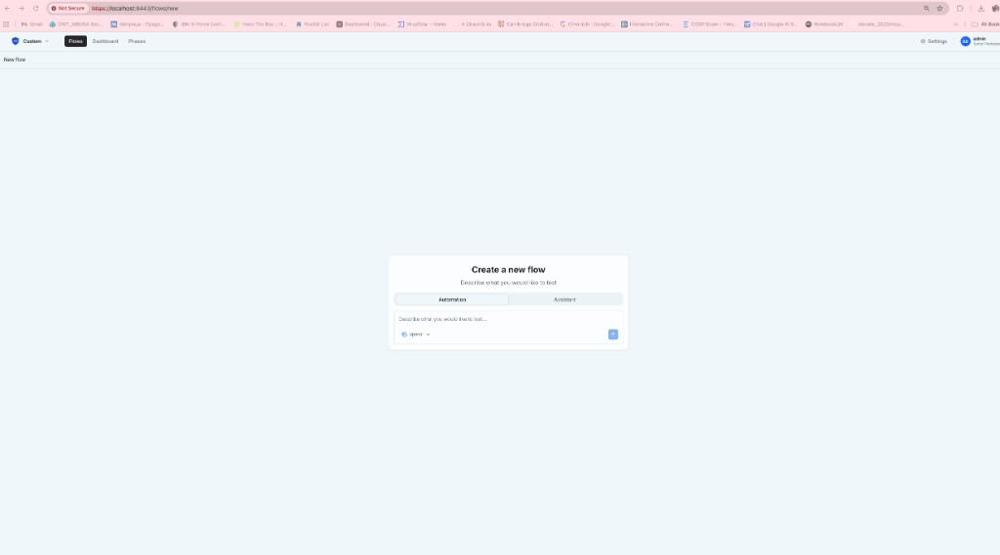
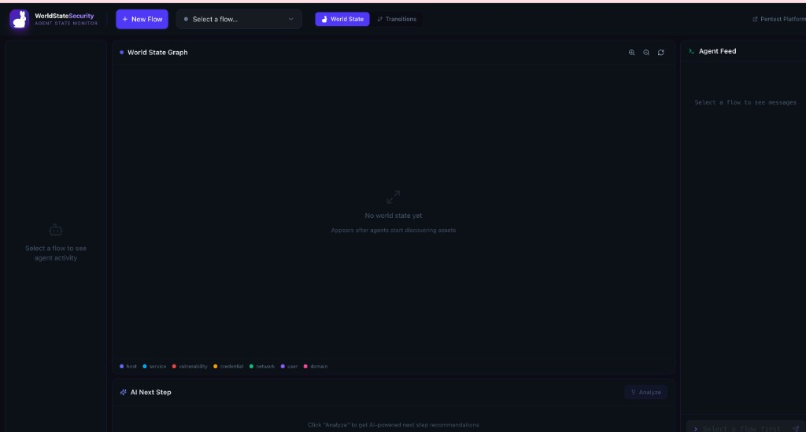
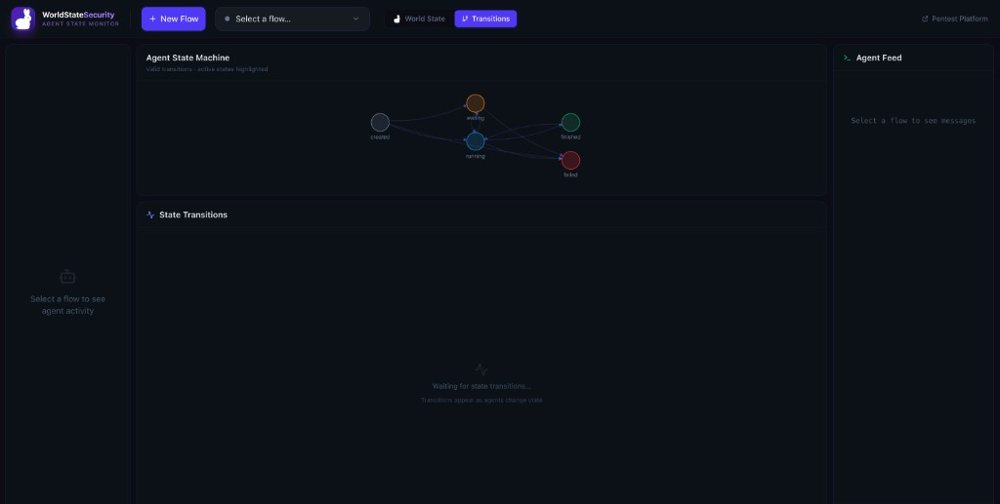
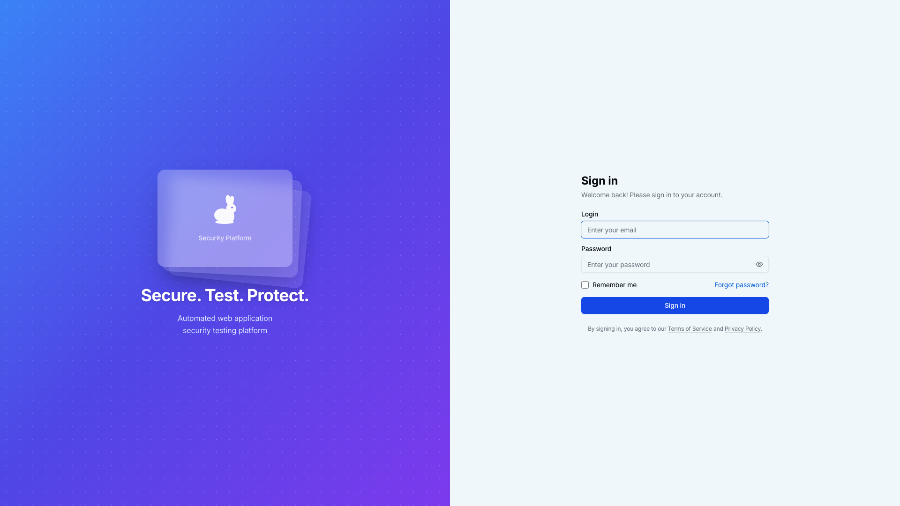
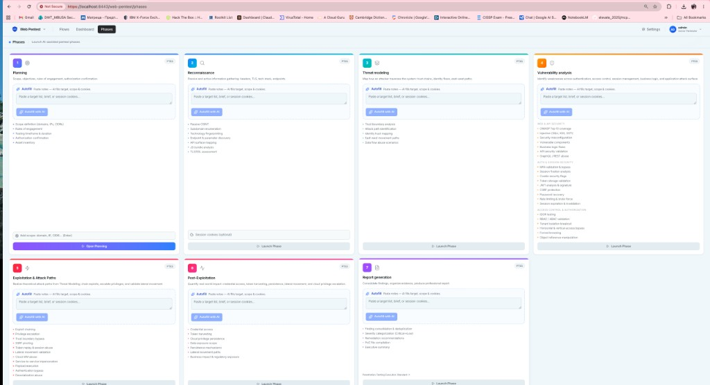
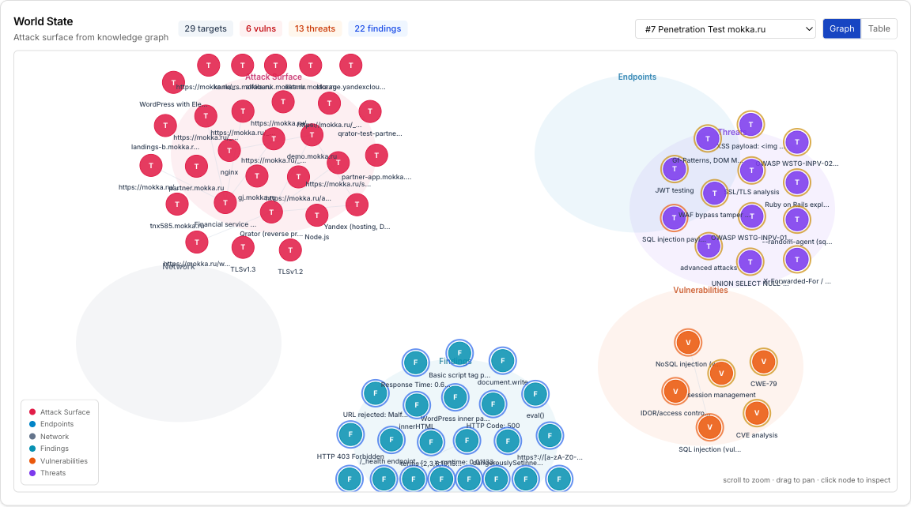
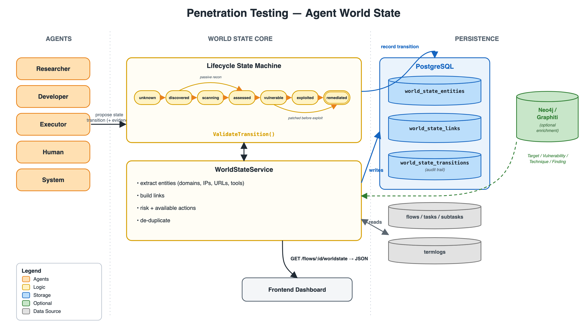

# RedScope (PentAGI)

AI-powered platform for automated security testing workflows.

RedScope combines a Go backend, a React frontend, and a multi-agent execution pipeline to run penetration testing flows with isolated tooling, persistent memory, and real-time updates.

## PentAGI vs This Fork (At a Glance)

| Area | PentAGI (Before) | Your Improved Version (Now) |
|---|---|---|
| Product focus | Strong pentest execution engine (flows, tools, reports) | Execution engine + visible agent intelligence layer |
| Operator visibility | Mostly narrative logs and final outputs | Phase-oriented monitoring, richer live telemetry, clearer operator control |
| Agent state tracking | Implicit in logs/chat | Explicit lifecycle direction (`created -> waiting -> running -> finished/failed`) and state-machine driven observability |
| World understanding | Useful logs, but weak queryable shared state | World-state foundation (`entities`, `transitions`) for cross-agent memory and fewer repeated actions |
| Planning quality | Easy to re-discover already known facts | Better basis for fact-driven next-step planning from current target state |
| UI for workflows | Standard dashboard views | Improved phases-first workflow view and world-state focused UX |
| Auditability | Action traces exist across multiple logs | Stronger reconstruction of handoffs, tool calls, transitions, and timeline |
| Strategic direction | Pentesting automation | Pentesting automation + **WorldState Security** as an intelligence platform |

### Visual Comparison (Before vs After)

**Before: PentAGI (original workflow UI)**



**After: your WorldState Security direction**




## WorldState Security Vision (Agent State Intelligence Platform)

### Core Idea

WorldState Security is a dedicated standalone application layered around the main PentAGI pentest platform, focused on observing, recording, and understanding AI agent behavior during penetration testing.

- **PentAGI** remains the execution engine (flows, tool runs, reports).
- **WorldState Security** is the intelligence layer (what agents know, what state they are in, and how they transition in real time).

### What This Platform Is Building Toward

1. **World State Graph**  
   A live force-directed graph of discovered hosts, services, vulnerabilities, credentials, and networks, including relationships between entities. As agents work, the graph grows as their shared operational mental model.
2. **Agent State Machine Recorder**  
   End-to-end lifecycle tracking for Researcher, Developer, Executor, and PenTester agents: `created -> waiting -> running -> finished/failed`, with timestamps and transition reasons for audit-grade observability.
3. **Directive Feed**  
   A terminal-style operational feed for live agent messages, tool activity, and operator directives to agent containers.
4. **AI Next Step**  
   AI recommendations derived from current world state to suggest the highest-impact next action.

### Deeper Vision

PentAGI is powerful, but traditionally opaque: agents execute actions while internal state is hard to inspect. WorldState Security makes that intelligence visible, recordable, and interactive, so humans can work alongside agents rather than only receiving final output.

The white rabbit identity is intentional: *follow the white rabbit* into the agent's internal reasoning path, state transitions, and exploration flow.

## Contents

- [What You Get](#what-you-get)
- [System Architecture](#system-architecture)
- [WorldState Security Vision (Agent State Intelligence Platform)](#worldstate-security-vision-agent-state-intelligence-platform)
- [What Is Improved In This Fork](#what-is-improved-in-this-fork)
- [In Progress: WorldState Security](#in-progress-worldstate-security)
- [Quick Start (Docker)](#quick-start-docker)
- [Configuration](#configuration)
- [Local Development](#local-development)
- [Optional Stacks](#optional-stacks)
- [Helper Binaries](#helper-binaries)
- [API Endpoints](#api-endpoints)
- [Security and Legal](#security-and-legal)

## What You Get

- Multi-agent workflow (research, planning, execution)
- Isolated command execution in Docker environments
- Backend APIs: REST + GraphQL + subscriptions
- Frontend UI for flow control and live execution updates
- Persistent memory based on PostgreSQL + pgvector
- Optional observability (OpenTelemetry/Grafana) and Langfuse analytics
- Optional Graphiti knowledge graph integration

## System Architecture

Main components:

- `backend/`: Go API server, orchestration, provider integrations
- `frontend/`: React + TypeScript web app
- `backend/migrations/sql/`: database schema migrations
- `observability/`: optional monitoring and telemetry configs

Execution flow:

1. User creates a flow from UI or API.
2. Agent pipeline analyzes scope and proposes actions.
3. Commands run in isolated execution environments.
4. Results and artifacts are stored and streamed to the UI.

## What Is Improved In This Fork

This repository is an actively improved version of PentAGI, focused on better visibility into agent execution and operator control.

Key improvements already implemented:

- Updated product identity and UI around the RedScope experience
- Better phase-oriented flow view for pentest lifecycle tracking
- Expanded live telemetry from backend logs to GraphQL/UI surfaces
- Initial world-state data layer (`entities`, `transitions`) to reduce repeated recon and improve cross-agent memory
- Stronger observability foundation for agent handoffs, tool calls, and timeline reconstruction

Current visual direction:




## In Progress: WorldState Security

**WorldState Security** is being built as a dedicated intelligence layer around PentAGI.

- PentAGI remains the execution engine (flows, tools, reports)
- WorldState Security becomes the real-time agent intelligence layer (state, context, transitions, recommendations)

Core capabilities under active development:

1. **World State Graph**  
   A live graph of discovered hosts, services, vulnerabilities, credentials, and relationships. This is the shared operational map of the target.
2. **Agent State Machine Recorder**  
   Full lifecycle recording for each agent (`created -> waiting -> running -> finished/failed`) with timestamps and transition reasons for audit-grade traceability.
3. **Directive Feed**  
   Terminal-style control and live message stream for agent-to-agent communication, tool execution, and findings.
4. **AI Next Step Panel**  
   AI recommendations based on current world state to guide the highest-impact next action.

Why this matters:

- Logs answer "what happened"
- World state answers "what is true now"

This distinction is essential for avoiding duplicate recon, preserving credential knowledge across handoffs, and planning from structured facts instead of long chat history.

Final UI snapshots (phases + graphs):

**Phases board (final):**


**World graph views (final):**




### Runtime Data Path (Current)

```text
agent runtime
  -> backend writes to PostgreSQL (msglogs / termlogs / agentlogs / searchlogs / toolcalls)
  -> GraphQL API
  -> UI and CLI/curl clients
```

Example GraphQL query for live message logs:

```bash
curl -sk -X POST https://localhost:5174/api/v1/graphql \
  -H "Content-Type: application/json" \
  -H "Origin: https://localhost:5174" \
  -d '{"query":"query{messageLogs(flowId:\"15\"){createdAt type message result}}"}' \
  | python3 -m json.tool
```

Local DB admin (development defaults):

- URL: `http://127.0.0.1:8080/`
- System: `PostgreSQL`
- Server: `pgvector`
- Username: `postgres`
- Password: `postgres`
- Database: `redscopedb`

## Quick Start (Docker)

### Prerequisites

- Docker + Docker Compose
- 4+ GB RAM recommended
- 20+ GB free disk space recommended

### 1. Prepare environment

```bash
cp .env.example .env
```

If needed, copy provider examples:

```bash
cp examples/configs/custom-openai.provider.yml example.custom.provider.yml
cp examples/configs/ollama-llama318b.provider.yml example.ollama.provider.yml
```

### 2. Configure at least one LLM provider

Set one of the following in `.env`:

- `OPEN_AI_KEY`
- `ANTHROPIC_API_KEY`
- `GEMINI_API_KEY`
- other supported provider credentials

### 3. Start core stack

```bash
docker compose up -d
```

### 4. Open application

- Main UI: `https://localhost:8443`
- GraphQL: `https://localhost:8443/api/v1/graphql`
- Swagger: `https://localhost:8443/api/v1/swagger/index.html`

## Configuration

Important variable groups in `.env`:

- **Server**: `PUBLIC_URL`, `SERVER_HOST`, `SERVER_PORT`, `SERVER_USE_SSL`
- **Database**: `DATABASE_URL`
- **LLM providers**: `OPEN_AI_KEY`, `ANTHROPIC_API_KEY`, `GEMINI_API_KEY`, `BEDROCK_*`, `OLLAMA_*`, etc.
- **Search providers (optional)**: `DUCKDUCKGO_ENABLED`, `GOOGLE_API_KEY`, `GOOGLE_CX_KEY`, `TAVILY_API_KEY`, `TRAVERSAAL_API_KEY`, `PERPLEXITY_API_KEY`, `SEARXNG_URL`
- **OAuth (optional)**: `OAUTH_GOOGLE_CLIENT_ID`, `OAUTH_GOOGLE_CLIENT_SECRET`, `OAUTH_GITHUB_CLIENT_ID`, `OAUTH_GITHUB_CLIENT_SECRET`

For full variable details, see project docs in `backend/docs/`.

## Local Development

### Backend (`backend/`)

```bash
go mod download
go build -trimpath -o pentagi ./cmd/pentagi
go test ./...
```

Generate GraphQL resolvers (after schema changes):

```bash
go run github.com/99designs/gqlgen --config ./gqlgen/gqlgen.yml
```

Generate Swagger docs (after REST annotation changes):

```bash
swag init -g ../../pkg/server/router.go -o pkg/server/docs/ --parseDependency --parseInternal --parseDepth 2 -d cmd/pentagi
```

### Frontend (`frontend/`)

```bash
npm ci
npm run dev
npm run build
npm run lint
npm run test
```

Regenerate GraphQL types after `.graphql` changes:

```bash
npm run graphql:generate
```

## Optional Stacks

Observability:

```bash
docker compose -f docker-compose.yml -f docker-compose-observability.yml up -d
```

Langfuse:

```bash
docker compose -f docker-compose.yml -f docker-compose-langfuse.yml up -d
```

Graphiti:

```bash
docker compose -f docker-compose.yml -f docker-compose-graphiti.yml up -d
```

All optional stacks:

```bash
docker compose -f docker-compose.yml -f docker-compose-langfuse.yml -f docker-compose-graphiti.yml -f docker-compose-observability.yml up -d
```

## Helper Binaries

Located in `backend/cmd/`:

- `ctester`: container/tool execution checks
- `ftester`: function/tool-calling tests
- `etester`: embedding provider tests
- `installer`: interactive setup wizard

Examples:

```bash
cd backend && go test ./...
cd backend && go run cmd/ctester/*.go -verbose
```

## API Endpoints

- GraphQL: `/api/v1/graphql`
- Swagger UI: `/api/v1/swagger/index.html`

For API authentication, use bearer tokens from the Settings UI (`API Tokens`).

## Security and Legal

- Use only on systems you are explicitly authorized to test.
- Never commit secrets (`.env`, API keys, private credentials).
- Rotate keys and tokens regularly.
- Review TLS, network exposure, and access control before production deployment.

License: MIT. See `LICENSE`, `NOTICE`, and `EULA.md`.
